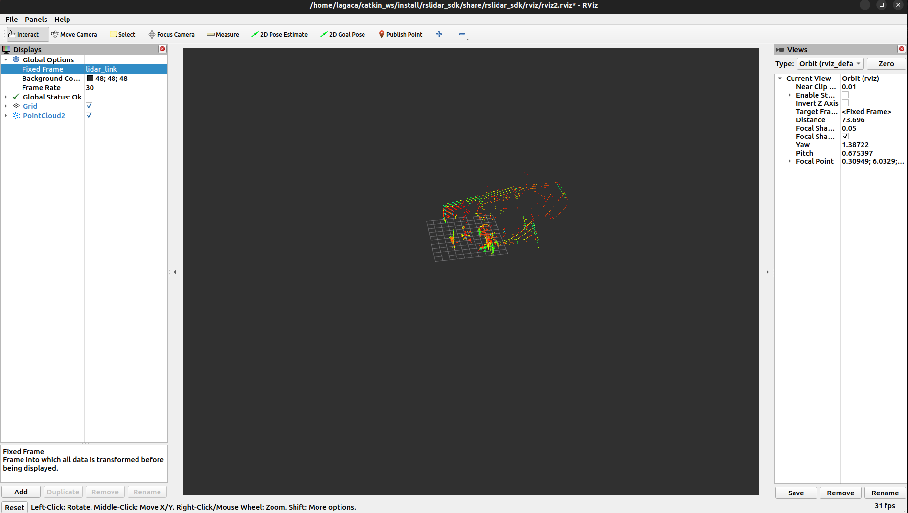
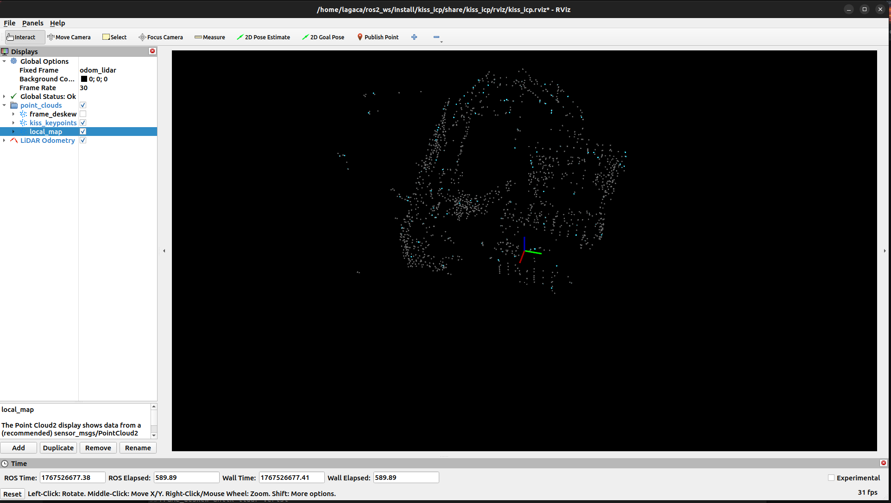
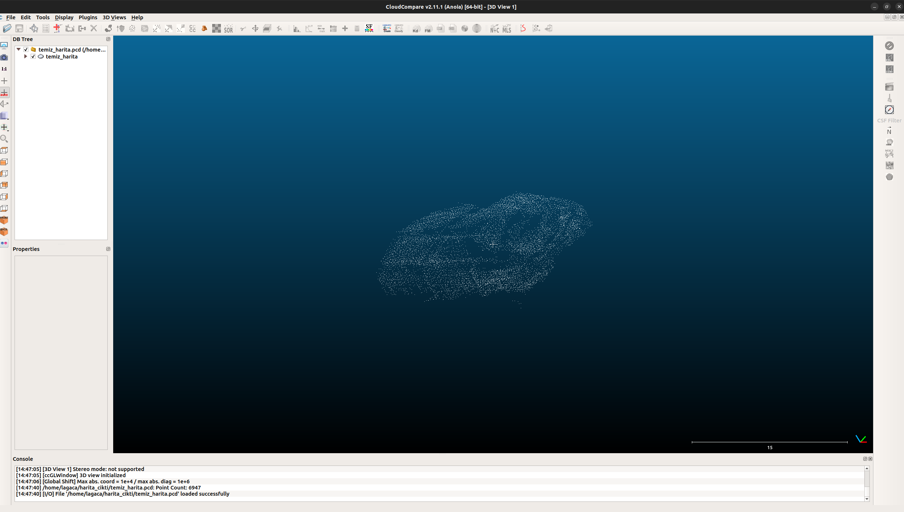
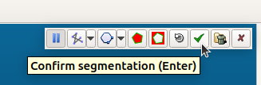
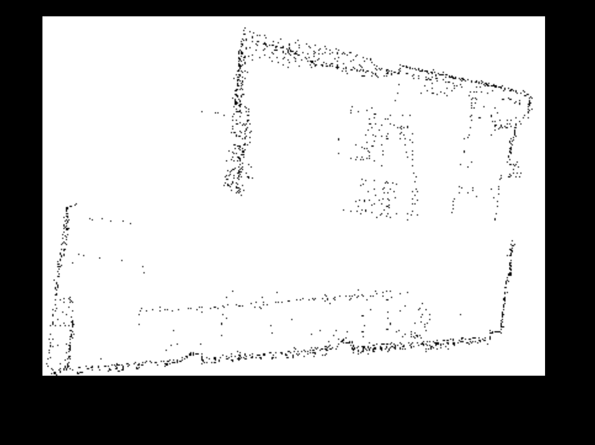
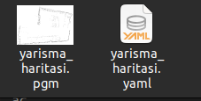
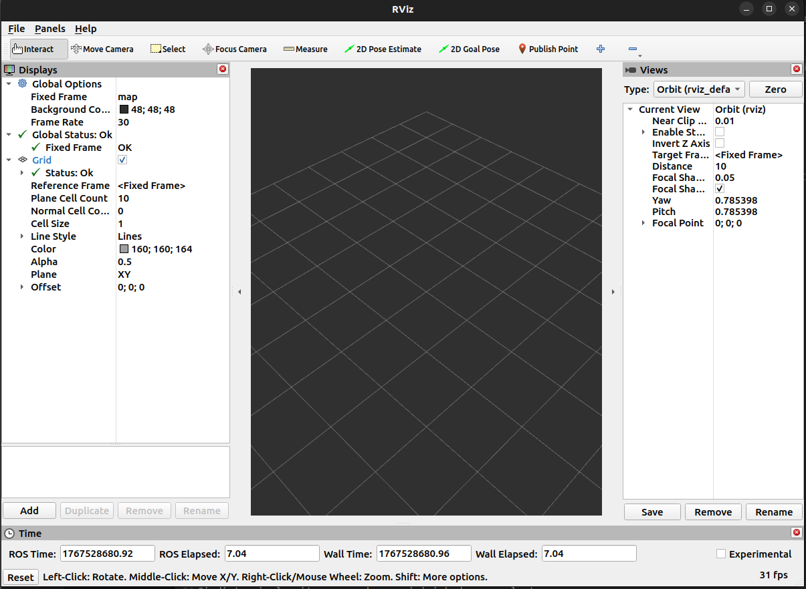
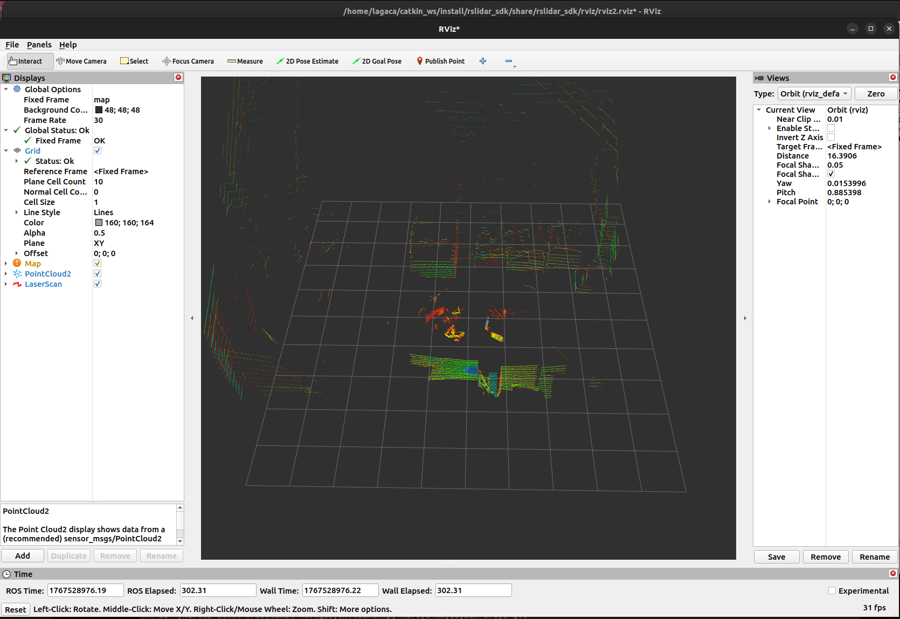
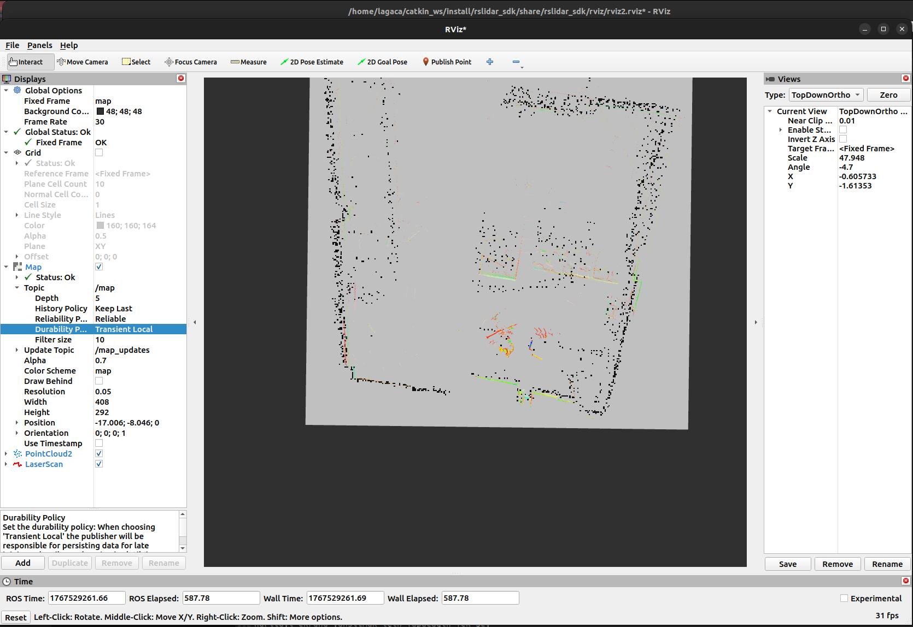

# ROS 2 + LiDAR SLAM ve Harita Üretim Kılavuzu

Bu doküman, **RSLiDAR + ROS 2 + KISS-ICP** kullanarak canlı harita üretme, kaydetme, temizleme ve RViz üzerinde tekrar kullanma sürecini **GitHub uyumlu README.md** formatında anlatır.

> 📌 Bu dosyayı **direkt kopyala–yapıştır** yaparak GitHub `README.md` içine koyabilirsin.

---

## 📂 Proje Klasör Yapısı

```text
YAPTIM/
├─ catkin_ws          # RSLiDAR SDK
├─ ros2_ws            # KISS-ICP workspace
├─ harita_cikti       # .pcd / .xyz / .pgm çıktılar
├─ goruntuler         # README'de kullanılan görseller
│   ├─ rviz.png
│   ├─ kiss_icp.png
│   ├─ kiss_icp_1.png
│   ├─ cloudcompare.png
│   ├─ makas.png
│   ├─ onay.png
│   ├─ ornek.png
│   ├─ ciktiDosyalar.png
│   ├─ rviz_harita.png
│   ├─ rviz_harita_yok.png
│   └─ rviz_harita_var.png
└─ README.md
```

---

## 1️⃣ LiDAR → ROS 2 Veri Akışı

Bu aşamada LiDAR donanımından Ethernet (UDP) ile gelen paketler `sensor_msgs/PointCloud2` formatına dönüştürülür.

### Terminal Komutu

```bash
cd ~/catkin_ws
source install/setup.bash
ros2 launch rslidar_sdk start.py
```

### Beklenen Çıktı

* Terminalde LiDAR veri akışı logları
* LiDAR fiziksel olarak dönmeye başlar



### ⚠️ Olası RViz Uyarısı (Normaldir)

```text
Message Filter dropping message: frame 'lidar_link' ... queue is full
```

### Çözüm

* **RViz → Global Options → Fixed Frame**
* `lidar_link` olarak ayarla

Alternatif olarak:

```bash
catkin_ws/src/rslidar_sdk/config/config.yaml
```

Dosyasından frame adını kontrol et.

---

## 2️⃣ LiDAR Odometrisi ve Haritalama (KISS-ICP)

Bu adımda **KISS-ICP**, ardışık LiDAR taramalarını eşleştirerek aracın anlık konumunu hesaplar.

### Terminal (Yeni terminal aç!)

```bash
source /opt/ros/humble/setup.bash
cd ~/ros2_ws
source install/setup.bash
ros2 launch kiss_icp odometry.launch.py topic:=/rslidar_points visualize:=true
```

### Yayınlanan Konular

* `/odometry` → Araç pozisyonu
* `/kiss/local_map` → Anlık harita

.png)

### RViz Görsel Ayarları

* **local_map** ✅
* **kiss_keypoints** ✅
* **frame_deskew** ❌ (kapalı)



### ⚠️ Fixed Frame Hatası

* **Global Options → Fixed Frame**
* `odom_lidar` olmalı

---

## 3️⃣ Canlı Haritanın Kaydedilmesi (.pcd)

KISS-ICP çalışırken üretilen harita **RAM üzerindedir**. Kalıcı hale getirmek için Python kaydedici kullanılır.

### Script: `harita_alici.py`

* `/kiss/local_map` konusunu dinler
* Haritayı **ASCII .pcd** olarak kaydeder

### Çalıştırma (Yeni Terminal)

```bash
cd ~/harita_cikti
python3 harita_alici.py
```

### Beklenen Çıktı

```text
Veri yakalandı!
```

Oluşan dosya:

```text
benim_haritam_XXX.pcd
```

---

## 4️⃣ CloudCompare ile Harita Temizleme 🧹

CloudCompare açılır ve `.pcd` dosyası içeri alınır.



### Segment (Makas) Aracı

.png)

### Temizlik Kuralları

* ❌ Tavan noktaları
* ❌ Yerdeki yansımalar
* ✅ Duvarlar
* ✅ Sabit engeller

Silmek istediğin alanı **yeşil çerçeveye al → Segment Out → Onayla**



---

## 5️⃣ Doğru Formatla Kaydetme

```text
Dosya Adı   : temiz_harita.xyz
Format      : ASCII cloud (*.xyz)
```

> ❗ Binary veya PCD seçme (Python okuyamaz)

---

## 6️⃣ 2D Haritaya Çevirme

```bash
cd ~/harita_cikti
python3 harita_cevirici.py
```

### Başarılı Çıktı

```text
ISLEM BASARILI!
```

Oluşan dosyalar:

* `yarisma_haritasi.pgm`
* `yarisma_haritasi.yaml`




---

## 7️⃣ RViz Üzerinde Haritayı Açma

⚠️ Önce **tüm terminalleri kapat**

### 1. Terminal – LiDAR

```bash
cd ~/catkin_ws
source install/setup.bash
ros2 launch rslidar_sdk start.py
```

### 2. Terminal – Navigasyon + Harita

```bash
cd ~/harita_cikti
ros2 launch robotaksi_navigasyon.launch.py
```

### 3. Terminal – RViz

```bash
rviz2
```



### RViz Ayarları

* Add → By Topic

  * `/map`
  * `/scan`
  * `/PointCloud2`

* **2D Pose Estimate** ile robot pozisyonu seç

---

## ⚠️ Harita Görünmüyorsa (QoS Sorunu)



### Çözüm

`/Map` → **Durability Policy**

```text
Volatile  →  Transient Local
```



---

## ✅ Sonuç

Bu rehber ile:

* LiDAR → ROS 2 veri akışı
* SLAM (KISS-ICP)
* Harita kaydı
* Temizleme
* 2D harita üretimi
* RViz entegrasyonu

**uçtan uca tamamlanmış olur.** 🚀
